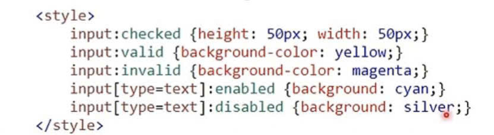
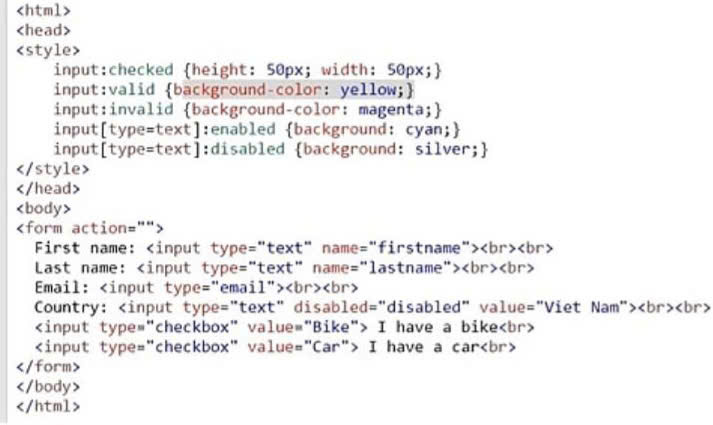
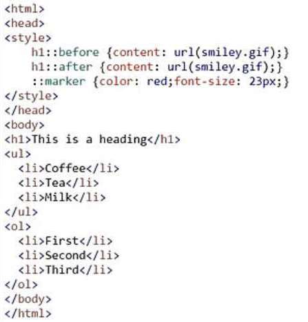

<html>
 <head>
     <title>Bài 17: Các mức ưu tiên của bộ</title>
 </head>
  <body>
  <h1>Luyện tập 1: Giải thích sự khác nhau giữa hai định dạng sau:</h1>
  
 #p123 + p {color: red;} 
 

 h2#p123 + p {color: red;}
  
   
• #p123 + p {color: red;} : áp dụng cho phần tử p với điều kiện phần tử p nằm ngay sau phần tử bất kì có mã định danh #p123

  
•h2#p123 + p {color: red;}: áp dụng cho phần tử p với điều kiện phần tử p nằm ngay sau phần tử h2 có mã định danh #p123

  <h1>Luyện tập 2:Trong phần Thực hành, các tên riêng (tên người, tên tổ chức) cần được bổ sung định dạng đóng khung và in nghiêng. Em sẽ thực hiện các yêu cầu này như thế nào?</h1>
   
• Đưa các tên riêng vào thẻ < em>... < / em > 

   
• Tạo mẫu định dạng CSS cho phần tử < em >: em {font-style: italic; border: 1px solid blue;}

 <h1> Vận dụng 1: Tìm hiểu thêm các dạng pseudo-class khác, nêu ý nghĩa và tìm ví dụ ứng dụ thực tế cho các kiểu bộ chọn này</h1>
     
Các trạng thái của phần tử input:

     
•checked: được chọn (type=checkbox)

     
•focus: được chọn (type=text

     
•enabled: sẵn sàng nhập dữ liệu

     
•disabled: vô hiệu hóa phần tử input

     
•valid: có hiệu lực

     
•invalid: không có hiệu lực

 

input:checked {height: 50px; width: 50px;}

input: valid {background-color: yellow;}

input: invalid {background-color: magenta;}

input[type=text]: enabled {background: cyan;}

input[type=text]: disabled {background: silver;}

</style>

<h2>Giải</h2>

<html>

<head>

</head>

<body>

<form action="">

First name: <input type="text" name="firstname">  

Last name: <input type="text" name="lastname">  

Email: <input type="email">  

Country: <input type="text" disabled="disabled" value="Viet Nam">  

<input type="checkbox" value="Bike"> I have a bike 

<input type="checkbox" value="Car"> I have a car 

</form>

</body>

</html>

 <h1> Vận dụng 2: Tìm hiểu thêm các dạng pseuso-element khác, nêu ý nghĩa và tìm ví dụ ứng dụng thực tế cho các kiểu bộ chọn này.</h1>
 
Các phần tử giả:

•before: thành phần phía trước

•after: thành phần phía sau

•marker: thành phần đánh dấu

h1::before {content: url(smiley.gif);}

h1::after {content: url(smiley.gif);}

::marke {color: red; font-size: 23px;}

</style>

<h2>Giải</h2>

 

</head>

<body>

<h1>This is a heading</h1>

<ul>

<li>Coffee</li>

<li>Tea</li>

<li>Milk</li>

</ul>

<ol>

<li>First</li>

<li>Second</li>

<li>Third</li>

</ol>

</body>

</html>

 
</body>
</html>
